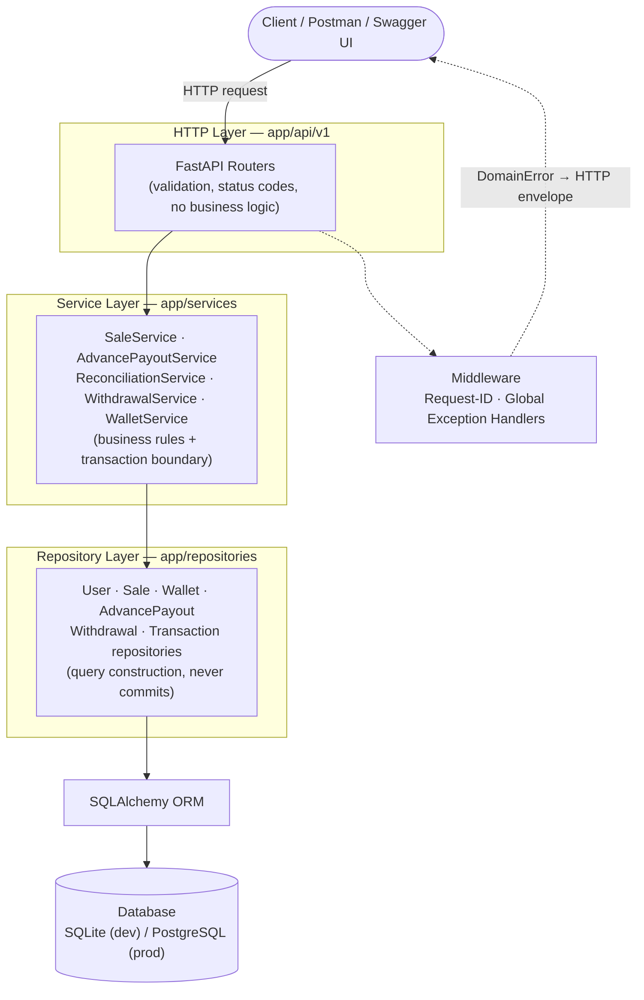
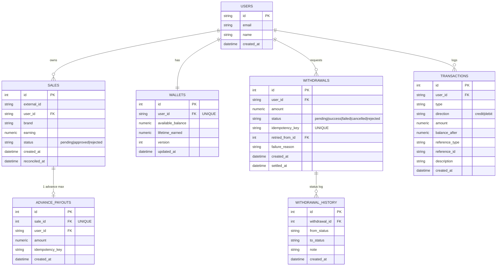
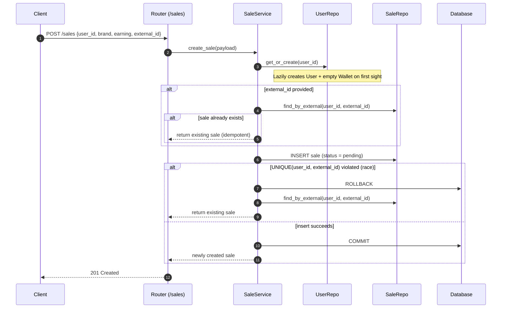
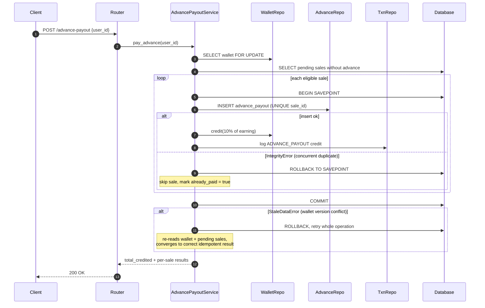
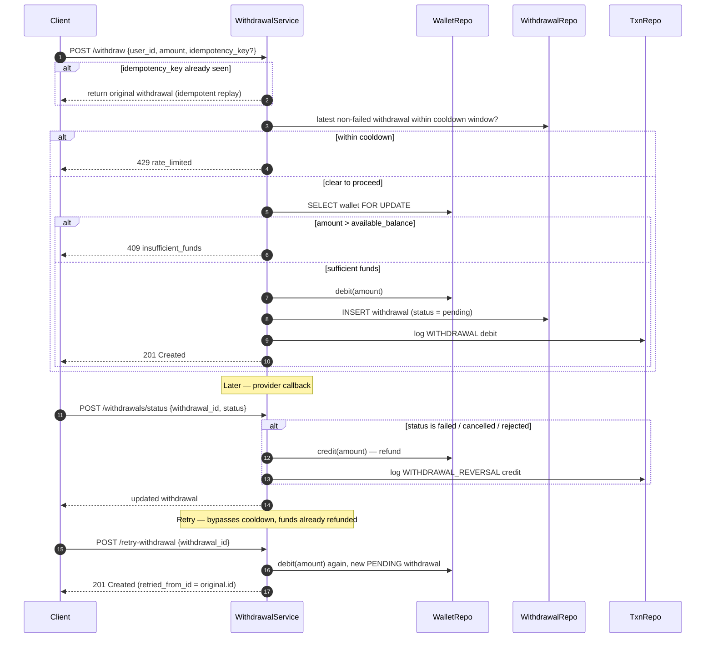
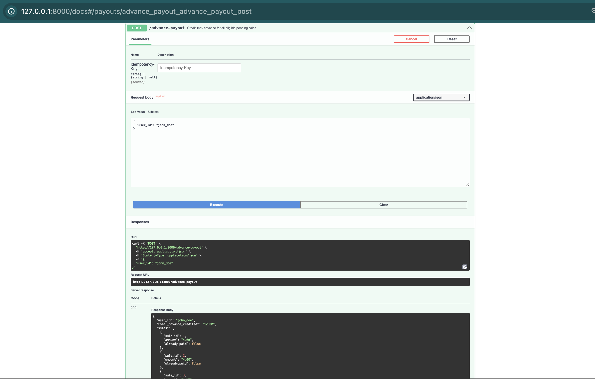
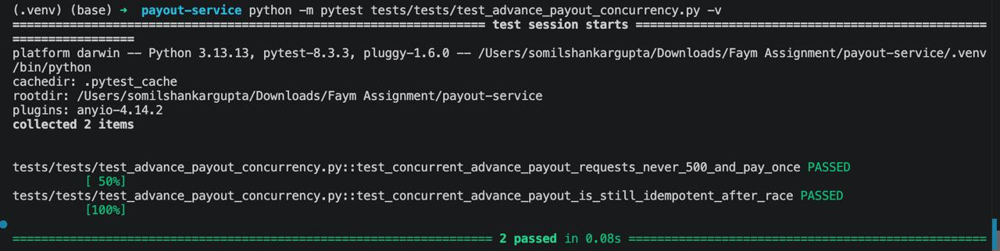

<div align="center">

# Payout Management Service

**A production-grade FastAPI backend for affiliate-sale advance payouts, wallet management, reconciliation, and withdrawals.**

[](https://www.python.org/)
[](https://fastapi.tiangolo.com/)
[](https://www.sqlalchemy.org/)
[](https://docs.pydantic.dev/)
[](https://docs.pytest.org/)
[](https://www.sqlite.org/)
[](#-license)

</div>

---

## Assignment

> This project was developed as part of the **Faym Software Development Engineer (SDE) Internship Assessment**.
>
> The objective was to design and implement a **production-ready payout management system** supporting:
>
> - ✅ Advance payouts
> - ✅ Wallet management
> - ✅ Reconciliation
> - ✅ Withdrawals
> - ✅ Idempotency
> - ✅ Concurrency safety

---

## Introduction

Affiliate platforms owe their sellers money the moment a sale is made — but the sale itself isn't final until it clears a reconciliation window. This service models that entire money lifecycle end-to-end:

1. A **sale** is ingested as `pending`.
2. The seller can immediately claim a **10% advance** against every pending sale.
3. Once the sale clears, it is **reconciled** as `approved` (the remaining 90% is credited) or `rejected` (the advance is reversed).
4. The seller can **withdraw** their available balance, subject to a cooldown, with automatic refund-and-retry if the withdrawal provider fails.

Every rupee that moves through the system is written to an **immutable transaction ledger**, every money-mutating operation is wrapped in a **database transaction with row-level locking**, and every write endpoint is **safe to retry** — whether the retry comes from a nervous client, a flaky network, or two requests that genuinely arrived at the same instant.

The system is built with a strict **layered architecture** (router → service → repository → ORM), fully typed with Pydantic v2 and SQLAlchemy 2.0, and backed by a pytest suite that exercises both the business rules and the concurrency edge cases directly.

---

## Key Features

| Category | Capability |
| --- | --- |
| **Sales** | Idempotent ingestion via `(user_id, external_id)`, pagination, filtering, and sorting |
| **Advance Payouts** | Credits 10% of every eligible pending sale; safe under duplicate and concurrent requests |
| **Reconciliation** | Batch approve/reject with correct wallet math for both outcomes |
| **Wallets** | ACID-consistent `available_balance` + `lifetime_earned`, guarded by optimistic locking (`version`) |
| **Withdrawals** | Configurable cooldown window, `Idempotency-Key` support, automatic refund on failure |
| **Retry Safety** | Failed / cancelled / rejected withdrawals can be retried without waiting out the cooldown again |
| **Audit Trail** | Every wallet mutation appends an immutable `transactions` row with a `balance_after` snapshot |
| **Concurrency Safety** | Row-level locking (`SELECT ... FOR UPDATE`), DB unique constraints, and in-process serialization on the wallet critical section |
| **Observability** | Structured JSON logs, per-request IDs, consistent error envelope |
| **Docs** | Auto-generated OpenAPI/Swagger at `/docs`, ReDoc at `/redoc` |

---

## Clean Folder Structure

```text
payout-service/
├── app/
│   ├── api/v1/             # Thin HTTP routers — parsing & status codes only, no business logic
│   ├── core/                # Settings (pydantic-settings), logging setup, domain exception hierarchy
│   ├── database/            # SQLAlchemy engine, session factory, declarative Base
│   ├── middleware/           # Request-ID injection + global DomainError → HTTP mapping
│   ├── models/               # SQLAlchemy ORM models & string enums (Sale, Wallet, Withdrawal, ...)
│   ├── repositories/          # Data-access layer — query construction only, never commits
│   ├── schemas/               # Pydantic request/response DTOs
│   ├── services/               # Business logic + transaction boundaries (the "brain" of the app)
│   └── main.py                 # FastAPI application factory
├── tests/                        # Pytest suite: unit, API, and concurrency tests
├── docs/
│   └── LLD.md                     # Low-level design: ER diagram, sequence diagrams, trade-offs
├── main.py                          # Uvicorn entrypoint
├── seed.py                           # Demo data seed script
├── requirements.txt
├── .env.example
└── README.md
```

---

## Architecture

The service follows a strict **layered architecture** with a single direction of dependency — each layer only knows about the layer directly beneath it.



** Layer responsibilities:**

- **Routers** — parse the request, call one service method, shape the response. No business logic.
- **Services** — own business rules *and* the unit-of-work (`commit` / `rollback`). Money-touching operations lock the wallet row (`SELECT ... FOR UPDATE`) and write an immutable `transactions` row.
- **Repositories** — own query construction. They `flush()` but never `commit()` — that decision belongs to the service.
- **Domain exceptions** (`app/core/exceptions.py`) are mapped to HTTP status codes by a single middleware layer, so services stay completely HTTP-agnostic.

---

## Database Design



** Constraints & indexes worth calling out:**

| Constraint | Purpose |
| --- | --- |
| `UNIQUE(sale_id)` on `advance_payouts` | Enforces one advance per sale — DB-level idempotency |
| `UNIQUE(user_id, external_id)` on `sales` | Idempotent sale ingestion |
| `UNIQUE(idempotency_key)` on `withdrawals` | Safe retry of `POST /withdraw` |
| `CHECK (available_balance >= 0)` on `wallets` | Never persist an illegally negative wallet write path |
| `CHECK (earning >= 0)` / `amount >= 0` | Reject negative money at the DB layer |
| `INDEX (user_id, status)` on `sales` | Fast "pending sales for user" lookups |
| `INDEX (user_id, created_at)` on `withdrawals`, `transactions` | Cooldown checks + timeline queries |
| `version_id_col` (optimistic lock) on `wallets` | Detects lost updates even if pessimistic locking is bypassed |

Full column-level detail lives in [`docs/LLD.md`](docs/LLD.md).

---

## Business Flow

<details>
<summary><strong> 1. Sale Creation</strong> (click to expand)</summary>



</details>

<details>
<summary><strong> 2. Advance Payout</strong> (click to expand)</summary>



</details>

<details>
<summary><strong> 3. Reconciliation</strong> (click to expand)</summary>

```mermaid
sequenceDiagram
    autonumber
    participant C as Admin
    participant S as ReconciliationService
    participant W as WalletRepo
    participant SR as SaleRepo
    participant T as TxnRepo

    C->>S: POST /reconcile [{sale_id, status}, ...]
    S->>W: SELECT wallet FOR UPDATE
    loop each item
        S->>SR: SELECT sale FOR UPDATE
        alt sale is pending
            alt approved
                S->>W: credit(earning - advance_paid)
                S->>T: log RECONCILE_APPROVED
            else rejected
                S->>W: debit(advance_paid, allow_negative = true)
                S->>T: log RECONCILE_REJECTED
            end
            S->>SR: sale.status = approved/rejected; reconciled_at = now
        else already reconciled
            S-->>C: 409 invalid_state
        end
    end
    S->>W: COMMIT
    S-->>C: approved/rejected counts + wallet_balance
```

</details>

<details>
<summary><strong> 4. Withdrawal</strong> (click to expand)</summary>



</details>

---

## API Documentation

> Interactive Swagger UI is served at **`/docs`** and ReDoc at **`/redoc`** — see the [screenshot placement](docs/screenshots/swagger-ui.png) below for where to embed a capture of it.

All error responses share a single envelope:

```json
{ "code": "insufficient_funds", "message": "…", "request_id": "…" }
```

### System

| Endpoint | Method | Description | Request | Response | Possible Errors |
| --- | --- | --- | --- | --- | --- |
| `/health` | `GET` | Liveness probe | — | `{"status": "ok"}` | — |

### Sales

| Endpoint | Method | Description | Request | Response | Possible Errors |
| --- | --- | --- | --- | --- | --- |
| `/sales` | `POST` | Ingest a new sale (idempotent via `external_id`) | `SaleCreate {user_id, brand, earning, external_id?}` | `201` `SaleRead` | `422` validation_error · `409` conflict (rare race on duplicate `external_id`) |
| `/sales` | `GET` | List / search / paginate sales | Query: `user_id?, status?, brand?, sort?, page?, page_size?` | `200` `PaginatedResponse<SaleRead>` | `422` validation_error |

### Payouts

| Endpoint | Method | Description | Request | Response | Possible Errors |
| --- | --- | --- | --- | --- | --- |
| `/advance-payout` | `POST` | Credit 10% advance for all eligible pending sales | `AdvancePayoutRequest {user_id, idempotency_key?}` + optional `Idempotency-Key` header | `200` `AdvancePayoutResponse {total_advance_credited, sales[], wallet_balance}` | `404` not_found (user) · `409` conflict (version-conflict retries exhausted — extremely rare) |



### Reconciliation

| Endpoint | Method | Description | Request | Response | Possible Errors |
| --- | --- | --- | --- | --- | --- |
| `/reconcile` | `POST` | Reconcile a batch of sales as approved/rejected | `ReconcileRequest {items: [{sale_id, status}]}` | `200` `ReconcileResponse {approved_count, rejected_count, credited_amount, reversed_amount, net_adjustment, wallet_balance}` | `422` validation_error · `404` not_found (sale) · `409` invalid_state (already reconciled / mixed users in one batch) |

### Withdrawals

| Endpoint | Method | Description | Request | Response | Possible Errors |
| --- | --- | --- | --- | --- | --- |
| `/withdraw` | `POST` | Request a withdrawal from wallet | `WithdrawalRequest {user_id, amount, idempotency_key?}` + optional `Idempotency-Key` header | `201` `WithdrawalRead` | `404` not_found (user) · `429` rate_limited (cooldown) · `409` insufficient_funds |
| `/retry-withdrawal` | `POST` | Retry a failed/cancelled/rejected withdrawal | `RetryWithdrawalRequest {withdrawal_id, idempotency_key?}` | `201` `WithdrawalRead` (`retried_from_id` set) | `404` not_found · `409` invalid_state (original not in a failure state) |
| `/withdrawals/status` | `POST` | Provider/admin callback to settle a withdrawal | `WithdrawalStatusUpdate {withdrawal_id, status, reason?}` | `200` `WithdrawalRead` | `404` not_found · `409` invalid_state (invalid transition) |
| `/withdrawals` | `GET` | List a user's withdrawals | Query: `user_id, page?, page_size?` | `200` `PaginatedResponse<WithdrawalRead>` | `422` validation_error |

### Wallet & Transactions

| Endpoint | Method | Description | Request | Response | Possible Errors |
| --- | --- | --- | --- | --- | --- |
| `/wallet` | `GET` | Get a user's wallet balance | Query: `user_id` | `200` `WalletRead {available_balance, lifetime_earned, updated_at}` | `404` not_found |
| `/transactions` | `GET` | List a user's wallet transactions | Query: `user_id, type?, page?, page_size?` | `200` `PaginatedResponse<TransactionRead>` | `422` validation_error |

<details>
<summary><strong>Domain error → HTTP status mapping</strong></summary>

| Exception | HTTP Status | `code` |
| --- | --- | --- |
| `ValidationError` | 422 | `validation_error` |
| `NotFoundError` | 404 | `not_found` |
| `ConflictError` | 409 | `conflict` |
| `InvalidStateError` | 409 | `invalid_state` |
| `InsufficientFundsError` | 409 | `insufficient_funds` |
| `RateLimitedError` | 429 | `rate_limited` |

</details>

---

## Design Decisions

> [!NOTE]
> Every decision below trades off simplicity against a concrete correctness or maintainability requirement from the assignment.

**Why FastAPI?**
Native Pydantic integration gives request/response validation "for free," dependency injection keeps the DB session lifecycle clean, and automatic OpenAPI generation means `/docs` is always accurate — no separate spec to maintain.

**Why SQLAlchemy?**
A mature, typed ORM (2.0-style `Mapped[]` columns) that supports both the pessimistic locking (`with_for_update()`) and optimistic locking (`version_id_col`) primitives this project needs, while staying portable between SQLite (dev) and PostgreSQL (prod) with zero code changes — only `DATABASE_URL` changes.

**Why the Repository Pattern?**
It isolates SQLAlchemy query construction from business rules. Services read like a description of the domain ("lock the wallet, list pending sales, credit the wallet") instead of a stream of `select()` statements, and repositories can be mocked in unit tests without a real database.

**Why a Service Layer?**
Services own the *unit of work* — where a transaction begins, what it touches, and when it commits or rolls back. Keeping that logic out of routers means the same business operation behaves identically whether it's called over HTTP, from a script, or from a test.

**Why Idempotency?**
Payment-adjacent APIs get retried — by flaky networks, impatient users, and upstream retries. `POST /sales` (via `external_id`), `POST /advance-payout` (via the `UNIQUE(sale_id)` constraint), and `POST /withdraw` (via `Idempotency-Key`) are all designed so that calling them twice with the same input never double-charges or double-pays.

**Why Optimistic Locking (`version_id_col`) on the wallet?**
The pessimistic `SELECT ... FOR UPDATE` is the primary defense, but it only serializes access for as long as a lock is actually held by the underlying database session. Optimistic locking is a second, independent check: if a wallet row was mutated between read and write by *any* path, the `UPDATE ... WHERE version = ?` simply matches zero rows and SQLAlchemy raises `StaleDataError` instead of silently applying a lost update.

**Why Database Constraints (not just application checks)?**
Application-level idempotency checks ("does this sale already have an advance?") have a race window between the check and the write. `UNIQUE(sale_id)` on `advance_payouts`, `UNIQUE(user_id, external_id)` on `sales`, and `UNIQUE(idempotency_key)` on `withdrawals` close that window at the only layer that can actually guarantee it — the database itself.

**Why Transactions?**
Every money-mutating service method is one atomic unit of work: lock the wallet, mutate it, write the ledger row, commit — all or nothing. A crash or exception mid-operation can never leave the wallet balance out of sync with the transaction log.

---

## Edge Cases Covered

| Edge Case | How It's Handled |
| --- | --- |
| **Duplicate payouts** | `UNIQUE(sale_id)` on `advance_payouts` + per-sale `SAVEPOINT`, so a duplicate insert is swallowed and reported as `already_paid` instead of failing the whole batch |
| **Duplicate withdrawals** | `Idempotency-Key` header/body replays return the original `WithdrawalRead` instead of creating a new debit |
| **Concurrent requests** | Wallet row locked via `SELECT ... FOR UPDATE`; `version_id_col` catches any lost update that slips past the lock; the advance-payout path also retries on conflict and serializes same-user requests in-process |
| **Negative wallet prevention** | `CHECK (available_balance >= 0)` at the DB layer for normal debits; the one deliberate exception (rejected-sale reversal) explicitly opts in via `allow_negative=True` because the money may already be gone |
| **Invalid reconciliation** | Reconciling an already-`approved`/`rejected` sale raises `409 invalid_state`; mixing sales from different users in one batch is rejected outright |
| **Retry safety** | Retrying a failed withdrawal bypasses the cooldown (the original already consumed it and the refund already landed) but still goes through the same debit + ledger logic as a fresh withdrawal |
| **Race condition handling** | Two simultaneous `POST /advance-payout` calls for the same user never both succeed at crediting the same sale, never return `500`, and the wallet balance converges to the mathematically correct total either way |



---

## Testing

The suite is organized into three groups:

- **Unit / business-rule tests** — 10% advance-payout math, reconciliation math (`-4 + 36 + 36 = 68`), insufficient-funds and cooldown rejection, failed-withdrawal refund + retry lifecycle.
- **API tests** — full request/response cycles through FastAPI's `TestClient`, including idempotent sale ingestion and idempotency-key replay on withdrawals.
- **Concurrency tests** — two simultaneous `POST /advance-payout` calls for the same user, asserting neither response is a `500`, the advance is paid exactly once per sale, and a follow-up call reports `total_advance_credited == 0.00`.

```bash
pytest -v
```

<div align="center">

*[Screenshots](docs/screenshots/tests-passed.png))*

**13 tests passing**

</div>

---

## Getting Started

### 1. Install

```bash
python -m venv .venv
source .venv/bin/activate
pip install -r requirements.txt
cp .env.example .env
```

### 2. (Optional) seed demo data

```bash
python seed.py
```

### 3. Run

```bash
uvicorn main:app --reload
```

Open **http://localhost:8000/docs** for the interactive Swagger UI.

<details>
<summary><strong>Sample request walkthrough</strong></summary>

```bash
# 1. Ingest three pending sales for john_doe (40.00 each)
for i in 1 2 3; do
  curl -sX POST localhost:8000/sales -H 'content-type: application/json' \
    -d "{\"user_id\":\"john_doe\",\"brand\":\"brand_1\",\"earning\":\"40.00\",\"external_id\":\"s$i\"}"
done

# 2. Advance payout — 10% of 120.00 = 12.00
curl -sX POST localhost:8000/advance-payout \
  -H 'content-type: application/json' \
  -d '{"user_id":"john_doe"}'

# 3. Reconcile: reject sale 1, approve sales 2 & 3 → net adjustment 68.00
curl -sX POST localhost:8000/reconcile \
  -H 'content-type: application/json' \
  -d '{"items":[
        {"sale_id":1,"status":"rejected"},
        {"sale_id":2,"status":"approved"},
        {"sale_id":3,"status":"approved"}
      ]}'

# 4. Check wallet balance
curl -s 'localhost:8000/wallet?user_id=john_doe'

# 5. Withdraw
curl -sX POST localhost:8000/withdraw \
  -H 'content-type: application/json' \
  -d '{"user_id":"john_doe","amount":"50.00","idempotency_key":"w-1"}'
```

</details>

---

## Future Improvements

- Async SQLAlchemy + `asyncpg` for higher-throughput I/O
- First-class idempotency-key store (currently opportunistic, per-endpoint)
- Outbox pattern + background worker for real payout-provider integration
- Alembic migrations wired into CI (schema is currently auto-created on startup)
- OpenTelemetry tracing spans across the router → service → repository boundary
- Role-based auth (JWT) — separating seller-facing endpoints from admin-only ones like `/reconcile`
- Per-IP rate limiting on write endpoints
- A `/metrics` endpoint for Prometheus scraping

---


## License

This project is licensed under the **MIT License**.

> [!IMPORTANT]
> No `LICENSE` file currently exists in this repository. Add one (the standard MIT License text, https://opensource.org/license/mit/, with your name and year) at the project root for the badge above to be backed by an actual license grant.

---

## Author

**Somil Shankar Gupta**

[](https://github.com/somil27)
[](https://linkedin.com/in/somil-shankar-gupta)
[](https://somilverse.online)

</div>
