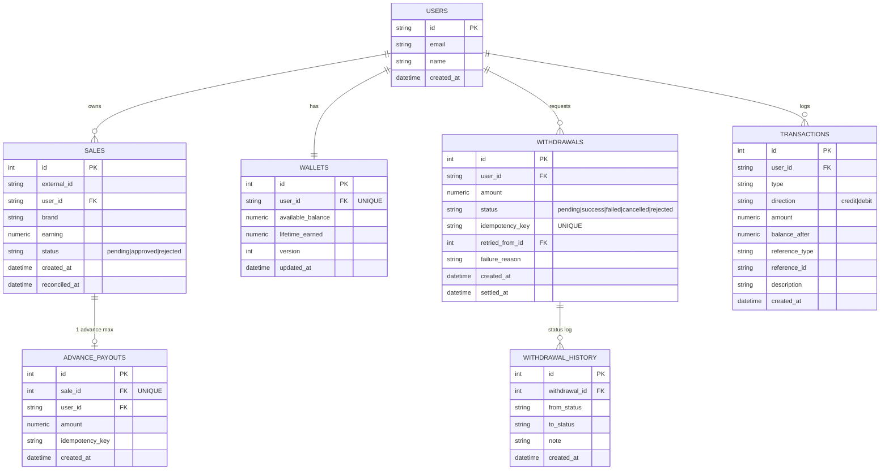
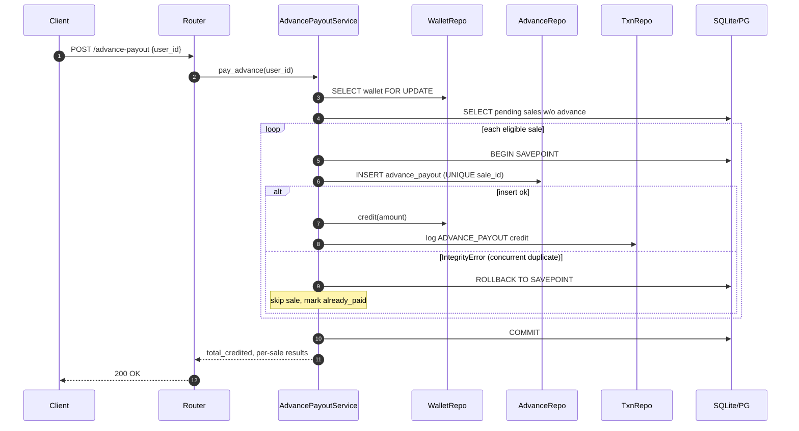
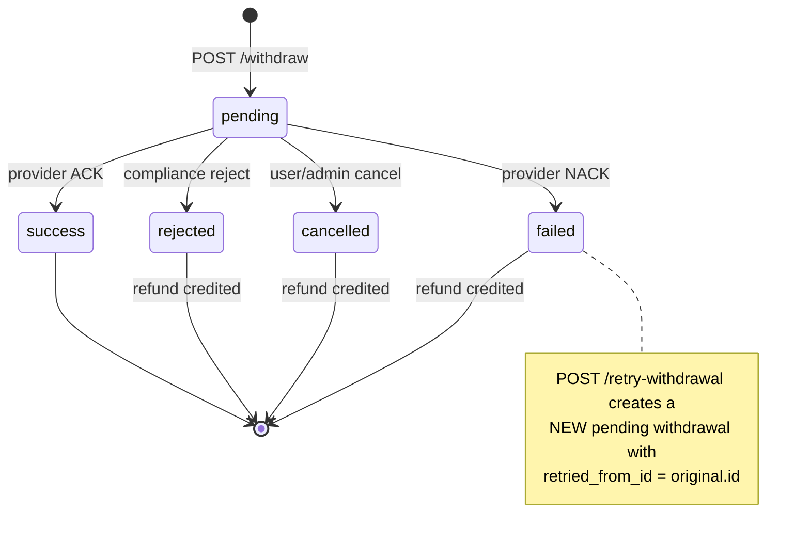
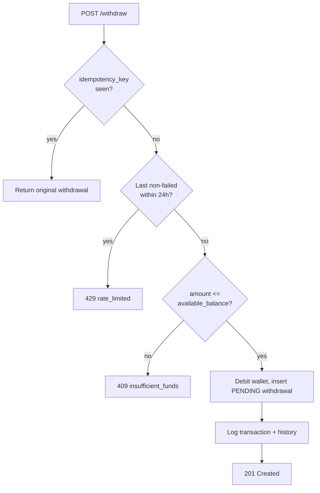

# Low-Level Design — Payout Management Service

## 1. Problem recap

Sales enter the system as `pending`. The service pays a **10 % advance** on all eligible pending sales, and later reconciles each sale as `approved` (credit the remainder) or `rejected` (reverse the advance). Users can **withdraw at most once per 24 h**, and any `failed` / `cancelled` / `rejected` withdrawal must be refunded and re-triable.

## 2. Domain model



Constraints & indexes worth calling out:

| Constraint                                            | Purpose                                              |
| ----------------------------------------------------- | ---------------------------------------------------- |
| `UNIQUE(sale_id)` on `advance_payouts`                | Enforces one advance per sale — DB-level idempotency |
| `UNIQUE(user_id, external_id)` on `sales`             | Idempotent sale ingest                               |
| `UNIQUE(idempotency_key)` on `withdrawals`            | Safe retry of `POST /withdraw`                       |
| `CHECK (earning >= 0)` / `amount > 0`                 | Reject negative money at the DB                      |
| `INDEX (user_id, status)` on `sales`                  | Fast "pending sales for user" queries                |
| `INDEX (user_id, created_at)` on `withdrawals`, `transactions` | Cooldown + timelines            |

## 3. Layer diagram

```text
┌─────────────────────────────────────────────────────────────┐
│  HTTP  (FastAPI)                                            │
│    routers  ─►  validate  ─►  dispatch                      │
└──────────────────────────┬──────────────────────────────────┘
                           ▼
┌─────────────────────────────────────────────────────────────┐
│  Services (business rules, transaction boundary)            │
│    SaleService, AdvancePayoutService,                       │
│    ReconciliationService, WithdrawalService, WalletService  │
└──────────────────────────┬──────────────────────────────────┘
                           ▼
┌─────────────────────────────────────────────────────────────┐
│  Repositories (query construction, no commits)              │
│    User / Sale / Wallet / AdvancePayout /                   │
│    Withdrawal / Transaction                                 │
└──────────────────────────┬──────────────────────────────────┘
                           ▼
                     SQLAlchemy ORM → DB
```

## 4. Key sequences

### 4.1 Advance payout (idempotent)



### 4.2 Reconciliation

```mermaid
sequenceDiagram
    autonumber
    participant C as Admin
    participant S as ReconciliationService
    participant W as WalletRepo
    participant SR as SaleRepo
    participant T as TxnRepo

    C->>S: /reconcile [{sale_id,status}]
    S->>W: lock wallet(user)
    loop each item
        S->>SR: SELECT sale FOR UPDATE
        alt sale is pending
            alt approved
                S->>W: credit(earning - advance)
                S->>T: log RECONCILE_APPROVED
            else rejected
                S->>W: debit(advance, allow_negative=true)
                S->>T: log RECONCILE_REJECTED
            end
            S->>SR: sale.status = <new>; reconciled_at = now
        else already reconciled
            S-->>C: 409 invalid_state
        end
    end
    S->>W: COMMIT
    S-->>C: summary
```

### 4.3 Withdrawal lifecycle + failure recovery



### 4.4 Withdrawal cooldown check



## 5. Concurrency & correctness

| Risk                                       | Mitigation                                                                    |
| ------------------------------------------ | ----------------------------------------------------------------------------- |
| Two advance-payout workers race            | `UNIQUE(sale_id)` + savepoint per sale + wallet row lock                      |
| Duplicate `POST /advance-payout`           | Same guarantees; second call returns credited=0                               |
| Duplicate `POST /withdraw` (network retry) | `Idempotency-Key` header/body → unique key returns original                   |
| Two withdrawals in the cooldown            | Wallet row lock + `latest_non_failed_within` check inside the same tx         |
| Reconciling the same sale twice            | `SELECT sale FOR UPDATE` + explicit `status == pending` check                 |
| Balance drift                              | Every mutation writes a `transactions` row with `balance_after` snapshot      |

## 6. Error model

All errors return the same envelope:

```json
{"code": "…", "message": "…", "request_id": "…"}
```

`DomainError` subclasses map cleanly to HTTP status:

| Exception              | Status |
| ---------------------- | ------ |
| `ValidationError`      | 422    |
| `NotFoundError`        | 404    |
| `ConflictError`        | 409    |
| `InvalidStateError`    | 409    |
| `InsufficientFundsError` | 409  |
| `RateLimitedError`     | 429    |

## 7. Trade-offs

- **SQLite in dev, Postgres in prod.** `FOR UPDATE` is a no-op on SQLite but SQLite serialises writers globally so tests still exercise the correctness path; Postgres provides real row-level locking.
- **Wallet allowed to go negative on rejection.** The advance may have been withdrawn already; a negative balance preserves accounting and naturally blocks further withdrawals.
- **Cooldown enforced in the service.** Kept configurable via env, at the cost of not being enforceable by a simple DB unique constraint.
- **Retries bypass the cooldown.** Otherwise a single provider failure would lock a user out for 24 h even though the money was refunded.
